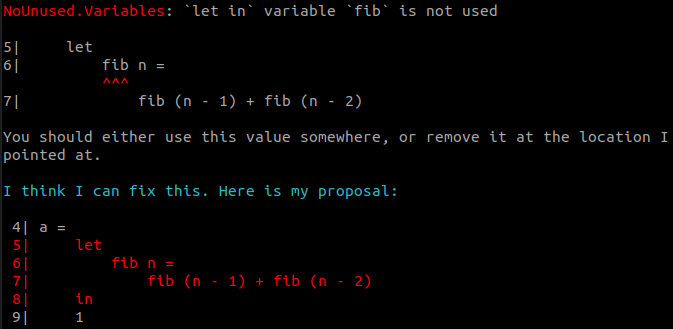
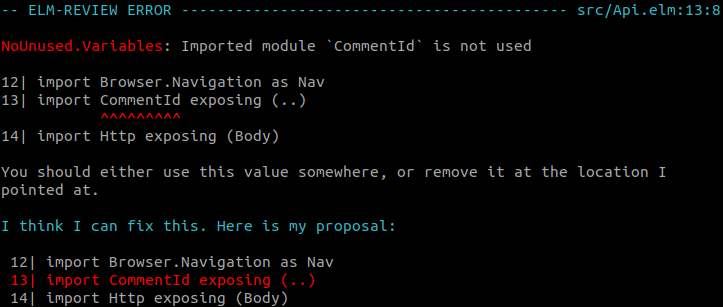
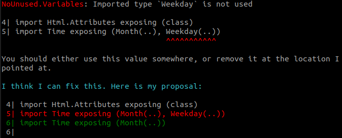
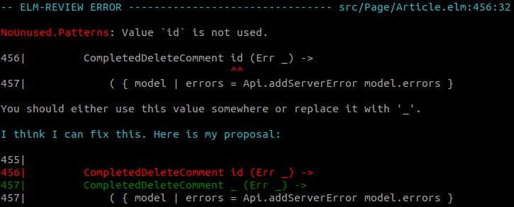
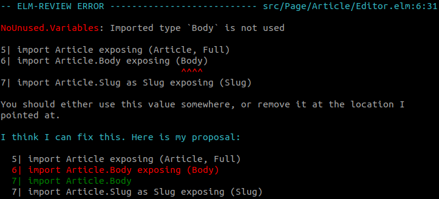

Today I'm releasing a **big** patch release for [`elm-review-unused`](https://package.elm-lang.org/packages/jfmengels/elm-review-unused/latest/), [`elm-review`](https://package.elm-lang.org/packages/jfmengels/elm-review/latest/)'s main package to detect and remove unused code from Elm code.

I wrote earlier on how [`elm-review`](https://package.elm-lang.org/packages/jfmengels/elm-review/latest/) and this package are [so good at detecting and removing dead code](/safe-dead-code-removal), and I hinted at some of the changes included in this release.

### Recursive let functions

We usually detect unused functions by counting how many times they are referenced. If the count is 0, then we consider it unused. Recursive functions reference themselves (by definition), meaning that to notice when one such function is unused, there needs to be some special handling.

`NoUnused.Variables` already reported recursive functions which are never called elsewhere, but we didn't do this for functions defined in a let expression.



A next step in this direction would be to detect unused indirectly-recursive functions. Things like `a` calling `b` calling `a` where neither is referenced elsewhere. That would be a bit trickier to keep track of, but it's definitely do-able!

## Better handling of imports

The `NoUnused.Variables` now looks at the contents of other files, which makes it much smarter about what is really happening with imports. This has an impact on plenty of situations:

### Unused imports that import everything

This one has been a thorn in my side for such a long time, especially since some IDE plugins would tell you about them already.



### Unused type imports that expose the constructor

Similarly, we were not reporting the exposing of a custom type even when that was possible.



If in the example above, the type `Weekday` was used in a type annotation but its constructors were not, then the proposed fix would be to only remove the `(..)`.

Removing imports does not provide a lot of value in practice, because `NoUnused.Exports` would already report what was exposed but never used in other modules. It is mostly a cosmetic thing. That said, it will help detect unused dependencies, and help you avoid potentially unnecessary [import cycle errors](https://github.com/elm/compiler/blob/9d97114702bf6846cab622a2203f60c2d4ebedf2/hints/import-cycles.md).

Side-note on that: `elm-review` now reports more accurate [import cycles than the compiler](https://twitter.com/jfmengels/status/1364676791185661961) ([see the announcement thread](https://twitter.com/elmreview/status/1368258108091469826)). I have provided feedback so that my learnings can be incorporated into the compiler in the future.

### Shadowing imported elements

Elm famously doesn't allow [shadowing variables](https://github.com/elm/compiler/blob/master/hints/shadowing.md). Except that it does, when you override something that was imported from another module.

That makes somewhat sense because you don't want code like the following to not compile because `text` was implicitly imported from `Html`. The imported `toUpper` also gets ignored by Elm. Maybe it could be reported by the compiler, but at the moment it will just become an unusable reference.

```elm
import Html exposing (..)
import Module exposing (toUpper)

updateText comment text = -- "text" overrides the reference to "Html.text"
  { comment | text = toUpper text }

toUpper = -- Overrides the reference to "Module.toUpper"
  String.toUpper
```

We were previously not reporting two kinds of problems due to not handling this shadowing well enough. The first one is when you define a variable (not at the top-level) named like an imported element.

```elm
import Html exposing (id)

something value =
    case value of
        SomeValue id -> -- this id is not used here
            model + 1
```



This is especially confusing because `id` can refer to different things even in the same function.

The second kind of problem is when you define a top-level variable or type which was also being imported, be it a type or a function.

```elm
import Article.Body exposing (Body)

type ValidatedField
    = Title
    | Body
```



I find this one to be very scary. If we take the example of `toUpper` above, removing the top-level declaration `toUpper` declaration will at best lead to a compiler error, and at worst, when the types are the same, a non-obvious change in the logic. So it's best to remove these early on while the problem hasn't shown up yet!

### Shared names for imports

`NoUnused.Variables` can now detect unused imports, even when different modules are imported with the same name or alias.

```elm
module A exposing (a)

import List
import SomeModule as List -- is unused

a = List.singleton 1
```

### Pattern matches

`NoUnused.Patterns` reports unused variables extracted in patterns (think case expressions). It had a bug where a variable would be considered used if another one with the same name was considered used somewhere else.

```elm
    case model.comments of
        ( Editing str, comments ) ->
          -- comments is used here
          str :: comments

        ( Editing "", comments ) ->
            -- comments is not used here, but we weren't reporting
            []
```


### Wildcard assignments

Let declarations assigned to `_` will now be reported and removed.

```elm
a =
    let
        _ = value
    in
    1
-- becomes
a =
    1
```

### Smaller changes

- The `main` function will now be reported if the project is a package.
- Unused infix operator declarations will now be removed (just in case the core team wants to start using `elm-review`)

And some more I may have forgotten and that you may or not notice!

## Afterword

TODO [so good at detecting and removing dead code](/safe-dead-code-removal)

I now believe that `elm-review` is the best tool out there to detect unused code and help you remove it. I don't believe that there is a tool out there that can remove Elm code that this one isn't able to\*. If you do find unused code somewhere, please [open an issue](https://github.com/jfmengels/elm-review-unused/issues/new/choose)!

_\* Possible exception for [`elm-xref`](https://github.com/zwilias/elm-xref) in some specific use-cases, like the indirectly-recursive functions._

TODO Mention that this is a snowball effect
TODO mention unused record fields
TODO Mention sponsorships
